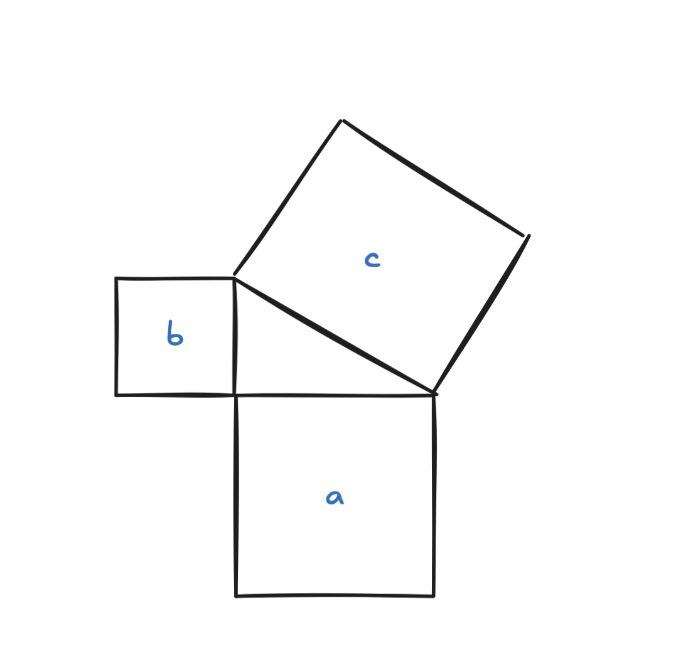

Atividade Final

A identidade de Pitágoras e a normalização de sinais

Conhecemos o Teorema de Pitágoras como a afirmação que para um triângulo retângulo, a soma das áreas dos dois quadrados pequenos formados nos lados do triângulo são iguais a área do quadrado grande. Ou seja, 
$a^2 + b^2 = c^2$
onde $c$ é a hipotenusa e $a$ e $b$ são os catetos.

O mais interessante do teorema é que ele é reversível, ou seja, o seu inverso também é verdadeiro. Para isso consideramos que um triângulo cujos lados satisfazem $aˆ2+bˆ2=cˆ2$ é necessariamente retângulo.

Como aplicado em aulas recentemente, usar esse conceito com um plano de coordenadas faz com que possamos medir o comprimento de um segmento de reta e descrevemos a equação de um círculo. Para isso consideramos que um raio é um segmento de reta e é possível descrever o círculo dando a posição de seu ponto central e o raio ao redor dele.

Usando como exemplo a figura acima onde o raio do círculo tem uma unidade de comprimento e aplicando o Teorema, temos a identidade trigonometria $sen 2 +cos 2 = 1$ e fornece uma maneira de visualizar entre coordenadas cartesianas. Para isso é preciso considerar que a coordenada $x$ será $cos(Ѳ)$ e a coordenada $y$ será $sin(Ѳ)$, onde $Ѳ$ é o ângulo feito com o eixo $x$ positivo. 

Isso também possibilita a aplicação do Teorema no valor de qualquer coisa que possa ser representada pelo comprimento de um segmento de reta em um plano com unidades marcadas em dois eixos em ângulos retos entre si.

Na figura acima por exemplo, a relação dos lados $|x 2 −x 1 |$ e $|y 2 −y |$ com o lado $d$ é a mesma que a dos lados $a$ e $b$ com o lado $c$. O símbolo de valor absoluto é utilizado para que possamos indicar o comprimento, esse valor é um número positivo porque o valor absoluto de qualquer número é positivo.

A identidade de Pitágoras é fundamental para cálculos nas mais diversas representações como vimos acima, sejam círculos ou gráficos. Sua propriedade de normalização de sinais permite calcular distâncias em coordenadas, ajuda a determinar pontos na circunferência a partir das coordenadas. Já em gráficos de sinais, podemos pensar na representação de amplitude e fase (telecomunicações), a identidade pitagórica relaciona os componentes reais e imaginários com a amplitude do sinal.

Para a área da tecnologia, sua importância se dá principalmente no processamento de informações como áudio e imagem, comunicações digitais, deep learning e redes neurais e até mesmo sistemas de radar. Podemos considerar que a identidade de Pitágoras fornece o fundamento matemático para calcular a norma de sinais, possibilitando sua normalização e estabelecendo uma base consistente para análise, comparação e processamento.
